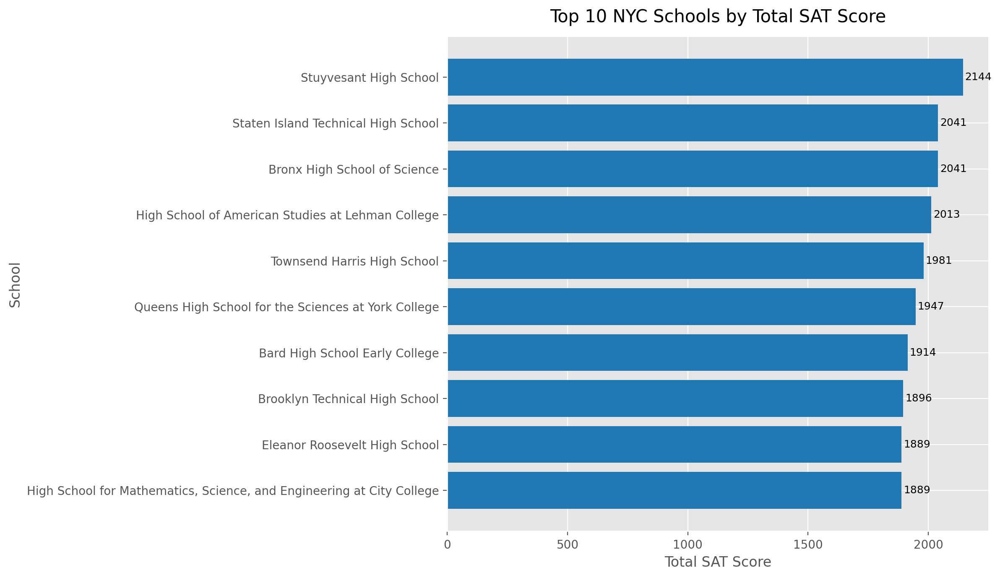
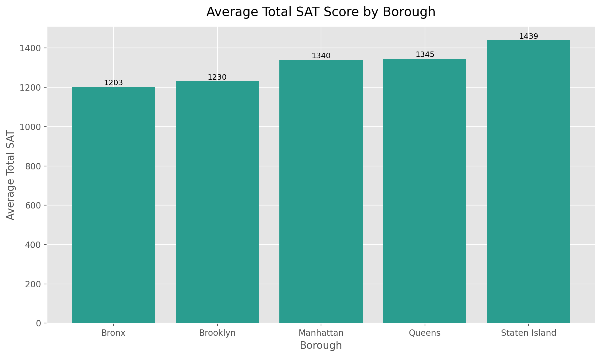

# NYC Public School SAT Score Analysis

This project analyzes SAT performance across New York City public schools and turns a simple one-off script into a more polished exploratory data analysis project. The main showcase is now a Jupyter notebook so reviewers can see the code, the findings, and the visuals together in one place on GitHub.

## Highlights

- 375 NYC public schools analyzed
- 10 schools scored at least 640 in average math
- Stuyvesant High School ranked first overall with a total SAT score of 2144
- Staten Island had the highest borough-level average total SAT
- Manhattan showed the widest performance spread across schools

## What This Project Answers

- Which NYC schools stand out in mathematics?
- Which schools have the highest total SAT scores?
- Which borough performs best on average?
- Which borough shows the widest spread in SAT performance?

## Dataset

- Source file: `schools.csv`
- Rows: 375 NYC public schools
- Key columns:
  - `average_math`
  - `average_reading`
  - `average_writing`
  - `percent_tested`
  - `borough`

## Project Structure

```text
nyc-school-test/
├── NYC_School_SAT_Analysis.ipynb
├── nyc-school-test.py
├── schools.csv
├── README.md
├── requirements.txt
├── .gitignore
├── key-findings/
│   ├── best_math_schools.csv
│   ├── borough_performance.csv
│   ├── largest_std_dev.csv
│   ├── summary.md
│   └── top_10_schools.csv
└── plots/
    ├── borough_average_sat.png
    └── top_10_total_sat.png
```

## Key Outputs

### Main Notebook

- `NYC_School_SAT_Analysis.ipynb`: notebook-first walkthrough of the analysis, including code, findings, and embedded visual references

### Tables

- `best_math_schools.csv`: schools with average math score of at least 640
- `top_10_schools.csv`: top 10 schools by total SAT score
- `borough_performance.csv`: borough-level averages, median, standard deviation, and participation rate
- `largest_std_dev.csv`: the borough with the greatest SAT score variability
- `summary.md`: concise written summary of the main findings

### Visuals

- `top_10_total_sat.png`
- `borough_average_sat.png`

## How To Run

```bash
pip install -r requirements.txt
python nyc-school-test.py
```

You can also open `NYC_School_SAT_Analysis.ipynb` in Jupyter or preview it directly on GitHub.

## Example Insights

- Stuyvesant High School ranks first by total SAT score.
- Several specialized schools dominate the top math rankings.
- Manhattan has the largest variation in total SAT performance across schools.

## Visual Snapshot

### Top 10 Schools by Total SAT



### Average Total SAT by Borough


